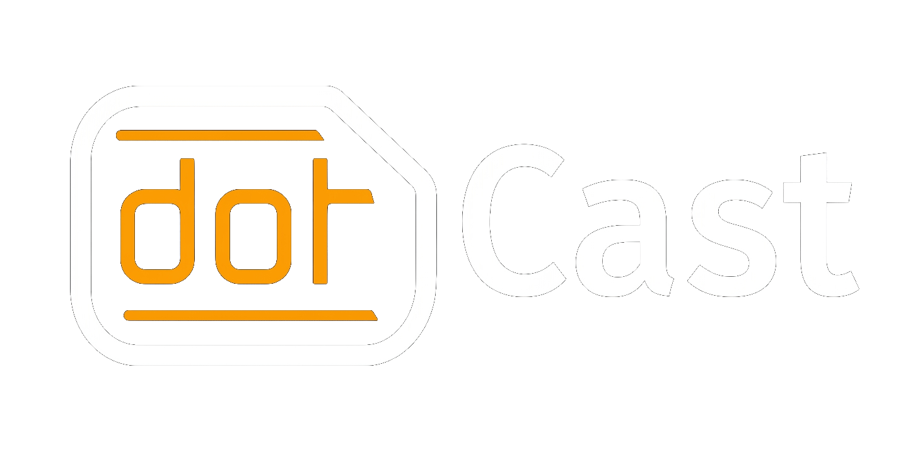

# DotCast

**Digital signage para Windows, Android e Android TV.** O DotCast permite gerir conteúdos e playlists num PC Windows e apresentá-los em ecrãs Android TV através da rede local. A aplicação Android serve de controlador móvel.

## Transferências

As versões oficiais estão na página [Releases](https://github.com/Miguel7258/DotCast/releases). Escolhe a versão mais recente e transfere o ficheiro adequado:

| Ficheiro | Plataforma | Utilização |
| --- | --- | --- |
| `DotCast-Setup.exe` | Windows 10/11 | Instalação ou atualização do DotCast para PC. |
| `DotCast-Mobile.apk` | Android | Aplicação de controlo para telemóvel ou tablet. |
| `DotCast-TV.apk` | Android TV | Player para Android TV e dispositivos compatíveis, como Xiaomi Box. |

Também podes abrir diretamente a [última versão para Windows](https://github.com/Miguel7258/DotCast/releases/latest/download/DotCast-Setup.exe), a [aplicação Android](https://github.com/Miguel7258/DotCast/releases/latest/download/DotCast-Mobile.apk) ou a [aplicação Android TV](https://github.com/Miguel7258/DotCast/releases/latest/download/DotCast-TV.apk).

## Instalação

1. Instala o `DotCast-Setup.exe` no PC Windows que vai gerir os ecrãs.
2. Instala `DotCast-Mobile.apk` no telemóvel, se quiseres usar o controlador móvel.
3. Instala `DotCast-TV.apk` no dispositivo Android TV que vai reproduzir a playlist.
4. Segue a configuração apresentada em cada aplicação e liga os dispositivos à rede usada pelo PC DotCast.

O Android pode pedir autorização para instalar aplicações obtidas fora da Play Store e confirmação no instalador do sistema. Permite a instalação apenas se descarregaste a APK desta página oficial de Releases.

## Atualizações

O DotCast para Windows consulta as Releases do GitHub quando o painel é iniciado e inclui também uma opção para procurar atualizações manualmente. Quando existe uma nova versão, o atualizador descarrega o instalador oficial e inicia o processo de atualização.

As APKs Android são publicadas nesta página. Para atualizar uma aplicação Android, transfere a APK da nova versão e confirma a instalação no dispositivo. A publicação na Google Play não está configurada neste momento.

## Suporte

Para comunicar um problema, contacta o administrador do DotCast na tua empresa e indica a versão instalada, o dispositivo e os passos que reproduzem o problema.

---

<strong>DotCast e DotBright são produtos reservados à DotBright Telecom e não se destinam à utilização pelo público geral.</strong>

